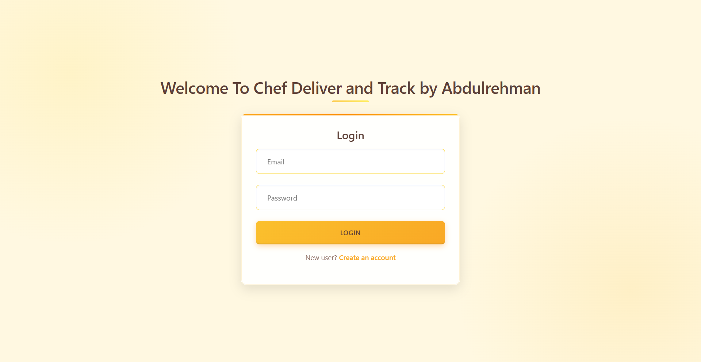
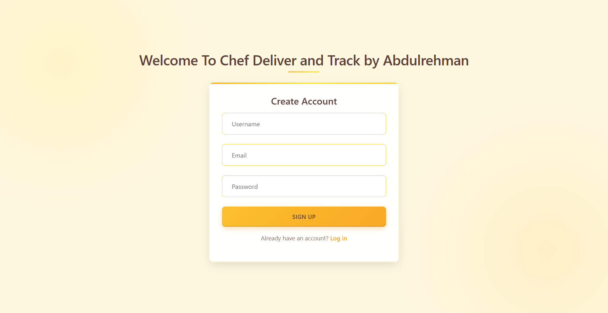
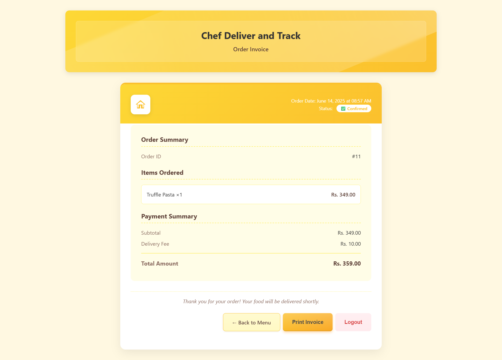
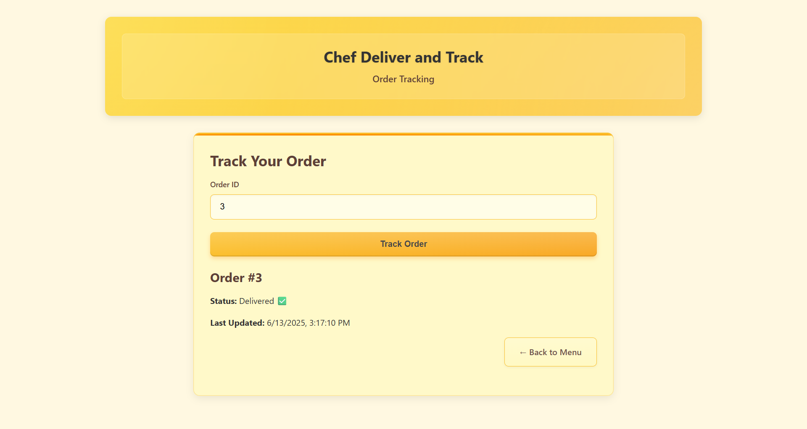
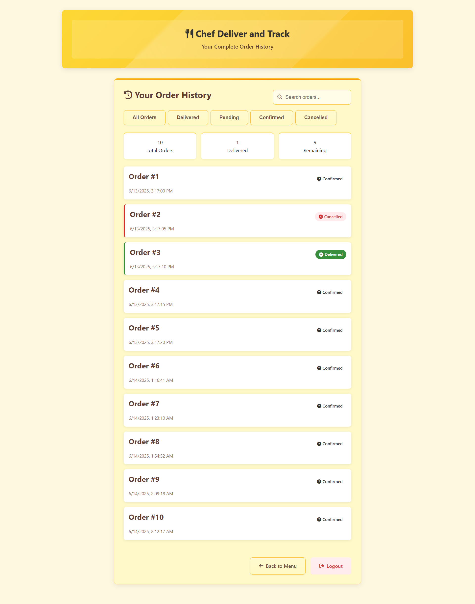
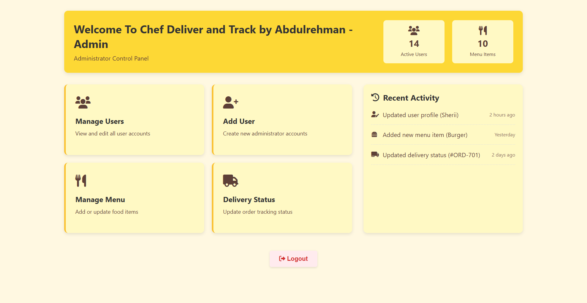
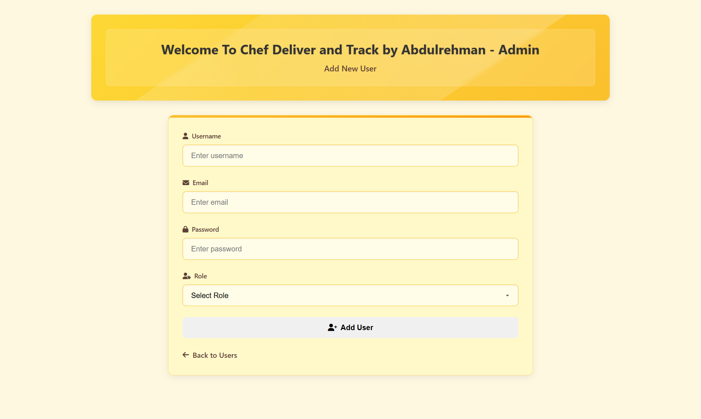
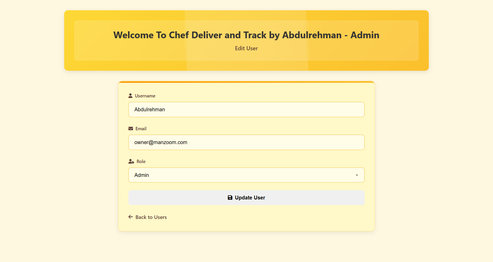
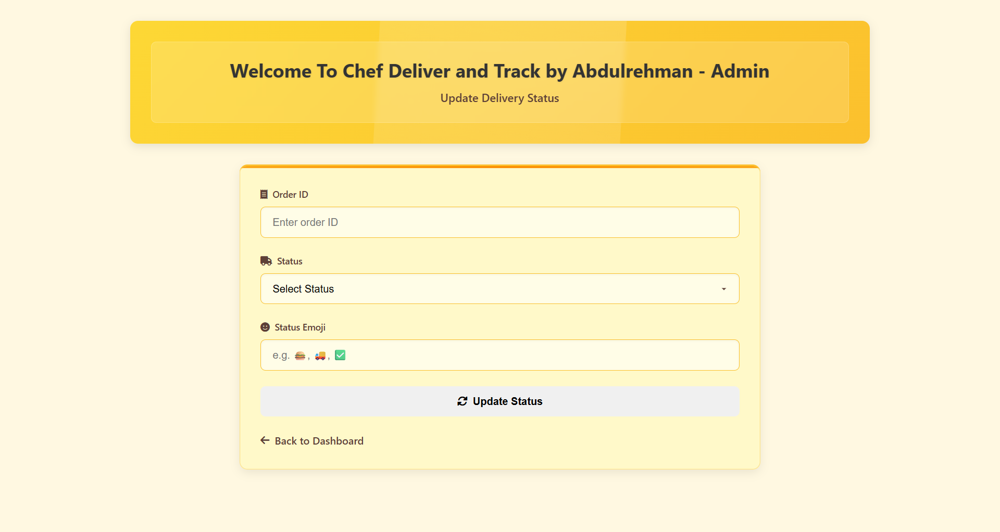

# 🍔 Online Food Delivery Tracking System

> **A Complete Full-Stack Food Ordering & Admin Dashboard Application**

A powerful Node.js + MySQL based project for handling orders, managing users, tracking deliveries, and much more.

---

## 📑 Table of Contents

* [Features](#features)
* [Technologies Used](#technologies-used)
* [Project Structure](#project-structure)
* [Installation Guide](#installation-guide)
* [Configuration](#configuration)
* [Database Schema](#database-schema)
* [Run the Application](#run-the-application)
* [API Documentation](#api-documentation)
* [Frontend Screenshots](#frontend-screenshots)
* [Environment Variables](#environment-variables)
* [Dependencies](#dependencies)
* [Contribution Guide](#contribution-guide)
* [Contact](#contact)
* [License](#license)

---

## 🚀 Features

* ✅ **Authentication System** (JWT-based + bcrypt encryption)
* 👤 **Role-Based Access (Admin/User)**
* 📋 **User Management Dashboard**
* 🛒 **Cart & Menu System**
* 🔄 **Order Lifecycle: Place → Track → Bill**
* 📦 **Real-Time Order History & Tracking**
* 🧾 **Billing & Delivery Management**
* 📱 **Responsive Frontend for Mobile/Desktop**

---

## 🧰 Technologies Used

| Layer         | Technologies                   |
| ------------- | ------------------------------ |
| **Frontend**  | HTML5, CSS3, JavaScript        |
| **Backend**   | Node.js, Express.js            |
| **Database**  | MySQL (`mysql2` driver)        |
| **Security**  | JWT (Auth), bcrypt (Passwords) |
| **Dev Tools** | dotenv, body-parser, CORS      |

---

## 📁 Project Structure

```bash
OnlineFoodDeliveryTrackingSystem/
├── backend/
│   ├── middleware/
│   │   └── authMiddleware.js
│   ├── routes/
│   │   ├── auth.js
│   │   ├── menu.js
│   │   ├── orders.js
│   │   └── users.js
│   ├── db.js
│   ├── server.js
│   ├── init.sql
│   ├── package.json
│   └── package-lock.json
├── frontend/
│   ├── admin/
│   │   ├── add-user.html
│   │   ├── dashboard.html
│   │   ├── delivery-status.html
│   │   ├── edit-user.html
│   │   ├── manage-menu.html
│   │   └── users.html
│   ├── customer/
│   │   ├── billing.html
│   │   ├── menu.html
│   │   ├── order-history.html
│   │   └── track-order.html
│   ├── css/
│   │   ├── billing.css
│   │   ├── dashboard.css
│   │   ├── login.css
│   │   └── Pages.css
│   ├── js/
│   │   └── main.js
│   ├── login.html
│   ├── signup.html
├── screenshots/
│   └── *.png
├── .env
├── README.md
└── venv/
```

---

## 🛠️ Installation Guide

```bash
git clone https://github.com/abdulrehmangulfaraz/online-food-delivery-system.git
cd online-food-delivery-system
npm install
```

---

## ⚙️ Configuration

1. Create a `.env` file inside `backend/`

```env
JWT_SECRET=your_secure_secret_key
```

2. Edit your MySQL credentials in `db.js`

```js
const pool = mysql.createPool({
  host: 'localhost',
  user: 'root',
  password: '',
  database: 'online_food_db',
  waitForConnections: true,
  connectionLimit: 10,
  queueLimit: 0
});
```

---

## 🧱 Database Schema

* SQL Schema is included in `backend/init.sql`
* Run it with:

```bash
mysql -u root -p < backend/init.sql
```

Includes:

* Users, Roles
* Menu Items
* Orders & Order\_Items
* Billing Table

---

## ▶️ Run the Application

```bash
npm start
```

Visit: [http://localhost:3000](http://localhost:3000)

---

## 🔌 API Documentation

### 🔐 Authentication Routes (`/api/auth`)

| Method | Endpoint | Description         |
| ------ | -------- | ------------------- |
| POST   | /signup  | Register user       |
| POST   | /login   | User login with JWT |

### 🍽️ Menu Routes (`/api/menu`)

| Method | Endpoint | Description              |
| ------ | -------- | ------------------------ |
| GET    | /        | Fetch all items          |
| POST   | /        | Add item (Admin only)    |
| DELETE | /\:id    | Delete item (Admin only) |

### 👤 User Routes (`/api/users`)

| Method | Endpoint | Description       |
| ------ | -------- | ----------------- |
| GET    | /        | All users (Admin) |
| GET    | /\:id    | Specific user     |
| PUT    | /\:id    | Update user       |
| DELETE | /\:id    | Remove user       |

### 📦 Order Routes (`/api/orders`)

| Method | Endpoint      | Description        |
| ------ | ------------- | ------------------ |
| POST   | /add-to-cart  | Add items to cart  |
| POST   | /checkout     | Finalize order     |
| GET    | /history      | Past orders        |
| GET    | /track/\:id   | Track order        |
| GET    | /\:id/billing | Billing summary    |
| PUT    | /update/\:id  | Admin update order |

---

## 🖼️ Frontend Screenshots

> Click below to preview the project visually.

### 🧑‍🍳 Customer Screens
<details>
<summary>Login | Signup | Menu | Order | Billing</summary>

- 
- 
- 
- 
- 
- 

</details>

### 🛠️ Admin Screens
<details>
<summary>Dashboard | User Mgmt | Menu | Delivery</summary>

- 
- 
- 
- 
- 
- 

</details>


---

## 🌐 Environment Variables

| Variable    | Description          |
| ----------- | -------------------- |
| JWT\_SECRET | JWT Token Secret Key |

---

## 📦 Dependencies

```json
{
  "dependencies": [
    "bcrypt",
    "body-parser",
    "cors",
    "dotenv",
    "express",
    "jsonwebtoken",
    "mysql2"
  ]
}
```

---

## 🤝 Contribution Guide

1. 🍴 Fork the repository
2. 🔧 Create your feature branch (`git checkout -b feature/xyz`)
3. 💾 Commit your changes (`git commit -m 'Add feature xyz'`)
4. 🚀 Push to branch (`git push origin feature/xyz`)
5. 📩 Submit a Pull Request

---

## 📬 Contact

> **Abdulrehman Gulfaraz**
> 📧 Email: [abdulrehmangulfaraz@gmail.com](mailto:abdulrehmangulfaraz@gmail.com)
> 💼 LinkedIn: [linkedin.com/in/abdulrehman-gulfaraz](https://www.linkedin.com/in/abdulrehman-gulfaraz)
> 🐙 GitHub: [@abdulrehmangulfaraz](https://github.com/abdulrehmangulfaraz)

---

## 📜 License

This project is licensed under the **MIT License**. Feel free to use, modify, and share.

---

Made with 💖 by **Abdulrehman** ✨
